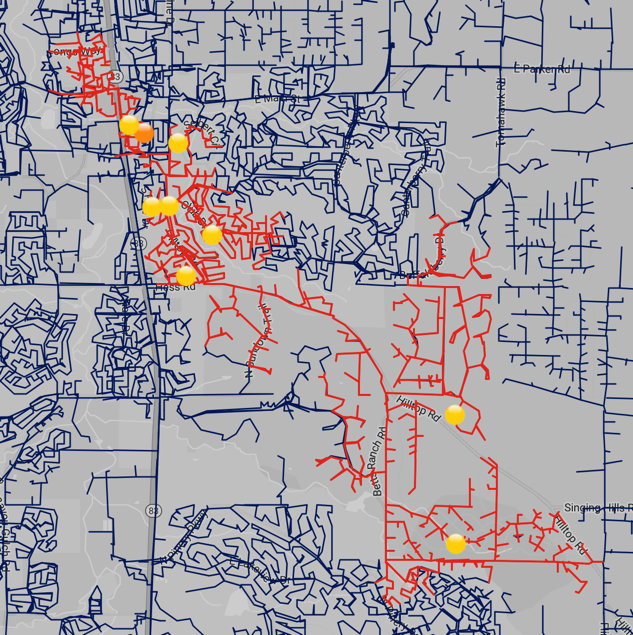
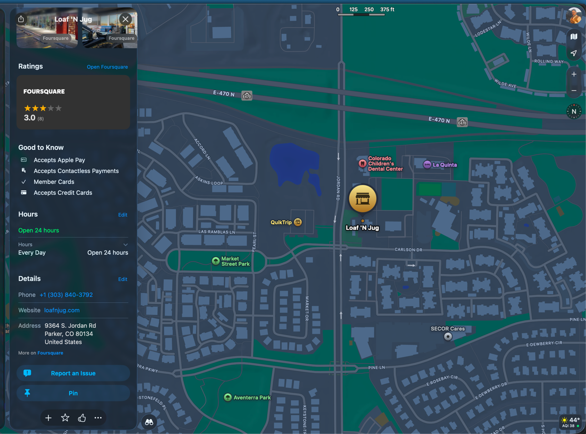

# test

From outage map:


Saved temp data to public/temp.json.

Found on map:



> 9364 S. Jordan Rd
> Parker, CO 80134
> United States

Query to calculate distance to nearest outage:

```sql
SELECT
    a.id,
    min(ST_Distance_Spheroid(
          a.location::POINT_2D,
          ST_EndPoint(ST_ShortestLine(a.location::POINT_2D, ST_LineString2DFromWKB(o.linestring)))
    )) as distance
FROM
    outages o,
    addresses a
WHERE
    a.id IN (2046043)
GROUP BY 
    a.id
ORDER BY distance ASC
;
```
